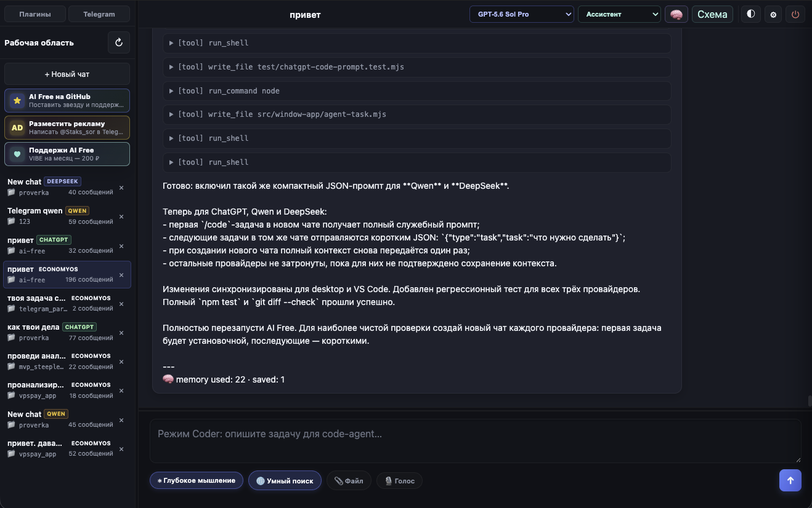

<h1 align="center">AI Free</h1>

<p align="center">
  <strong>Local AI client for DeepSeek, Qwen and ChatGPT with API, code agent, memory and skills</strong>
</p>

AI Free turns free AI web chats into a local developer tool.

Use **DeepSeek**, **Qwen** and **ChatGPT** from one desktop window, CLI, compatible APIs, IDE integrations and code-agent workflows — with local memory, skills and workspace-aware chats.

Good for:

- developers who want a free local AI coding assistant;
- people who use web AI chats but want API/CLI access;
- experiments with agents, memory, skills and IDE automation.

## What Is AI Free?

**AI Free** is an open-source local AI client and developer tool for using free web AI chats as a practical coding assistant. It connects **DeepSeek**, **Qwen** and **ChatGPT** to a desktop app, command line interface, local OpenAI-compatible API, Anthropic-compatible API, VS Code plugin, memory, skills and workspace-aware code-agent workflows.

People usually look for this project as a **free AI coding assistant**, **local AI client**, **OpenAI-compatible API for Qwen or DeepSeek**, **ChatGPT desktop client**, **Qwen VS Code extension**, **DeepSeek code agent**, **free alternative for AI developer tools**, or **local agent with memory and skills**.

## Popular Use Cases

- Run Qwen, DeepSeek and ChatGPT from one local desktop app.
- Use Qwen or DeepSeek through an OpenAI-compatible API endpoint.
- Connect local AI chats to VS Code, Continue, Kilo Code and other developer tools.
- Ask a code agent to read and edit a project folder with controlled command permissions.
- Keep local memory, skills and reusable workflows for repeated development tasks.
- Build agent pipelines, Telegram workflows and browser automation around free web AI providers.

## ✨ Highlights

- **One local app:** DeepSeek, Qwen and ChatGPT chats in one workspace.
- **Developer interfaces:** desktop UI, CLI, OpenAI-compatible API and Anthropic-compatible API.
- **Code agent:** `/code` mode with workspace file access and controlled command permissions.
- **Memory and skills:** long-term memory, memory graph and reusable task workflows.
- **Project instructions:** hierarchical `AGENTS.md` files are reloaded before every code-agent task; nested files apply to their own directory tree.
- **IDE-friendly:** works with tools such as Continue, Kilo Code and PyCharm ACP-compatible flows.
- **Local-first sessions:** provider browser sessions and app state are stored on your machine.

## 🌍 Выберите язык / Choose your language

<p>
  <a href="README.md"></a>
  <a href="docs/readme/README.en.md"></a>
  <a href="docs/readme/README.es.md"></a>
  <a href="docs/readme/README.pt.md"></a>
  <a href="docs/readme/README.de.md"></a>
  <a href="docs/readme/README.fr.md"></a>
  <a href="docs/readme/README.zh.md"></a>
  <a href="docs/readme/README.hi.md"></a>
  <a href="docs/readme/README.ar.md"></a>
</p>

<p align="center">
  
  
  
  
</p>

<p align="center"><strong>AI Free 0.4.25</strong></p>

<p align="center">
  
</p>

> Локальный AI-клиент, который превращает веб-чаты DeepSeek, Qwen и ChatGPT в инструмент для разработчика: окно чатов, CLI, совместимые API, `/code`-агент, память, skills и IDE-интеграции.

---

## ⭐ Понравилось? Поставь звезду

Если AI Free экономит тебе время, поставь звезду на GitHub — это помогает проекту появляться в поиске и рекомендациях.

## 💳 Поддержать развитие

Если хочется отблагодарить материально — любая сумма даёт сигнал, что проект имеет смысл, и мотивацию добавлять новые фичи (мультипровайдер Qwen/Kimi, attachments, стриминг ответов и т.д.).

- **Карта (ОТП Банк):** `2201 9604 2500 7505`

Спасибо!

---

Архитектурно проект разделён на модули в `src/` (auth, browser, providers, code-agent, **memory**, **skills**, agent-orchestrator, state, window-app, api, cli). Точка входа — `bin/deepseek.mjs`. Юнит-тесты запускаются командой `npm test` во встроенном Node test runner; точное число зависит от текущей версии. Архитектура памяти и skills — [docs/AI_FREE_BRAINS_AND_SKILLS_PLAN.md](docs/AI_FREE_BRAINS_AND_SKILLS_PLAN.md). Сценарий для видео — [docs/VIDEO_SCRIPT.md](docs/VIDEO_SCRIPT.md).

## ✨ Что внутри

- 💬 **Три провайдера:** DeepSeek, Qwen и ChatGPT в одном окне с выбором модели при создании беседы.
- 🔑 **Авто-логин DeepSeek:** один вход через браузер, затем тихое восстановление сессии или окно re-login.
- 🔐 **Авто-логин Qwen и ChatGPT:** отдельные профили и локальные сессии для каждого провайдера.
- 🪟 **Окно чатов** (`localhost:4317`): несколько параллельных бесед, каждая привязана к своей папке-проекту.
- ⌨️ **CLI-режим:** REPL в терминале для скриптовых сценариев и быстрых вопросов.
- 🛠️ **`/code` агент:** доступ к файлам workspace и разрешённым командам.
- **🧠 Memory:** долговременная память агента — SQLite FTS5 + Markdown vault (`~/.ai-free/memory/`). Переключатель в topbar, просмотр в Settings → Агент.
- **`AGENTS.md`:** правила проекта загружаются перед каждой агентской задачей. Корневой файл действует на весь workspace, вложенный — на свою директорию и её подкаталоги и имеет приоритет над родительским.
- **🔗 Memory graph:** связи task ↔ file ↔ bug ↔ fix; расширяет контекст при повторных задачах.
- **⚡ Skills:** встроенные `code-review`, `bug-fix`, `video-script`; auto-match по задаче; `/skill <id> <task>`.
- **Agent orchestrator:** перед `/code` собирает актуальные `AGENTS.md`, memory и skill в system prompt.
- 🔌 **Совместимые API** (`localhost:4318`): OpenAI и Anthropic для Kilo Code, Continue и других IDE.
- 🎙️ **Голосовой ввод:** Parakeet V3 скачивается отдельно только при первом использовании.
- 📁 **Файловый браузер:** при создании чата можно выбрать папку или создать новую.

### Версия продукта

Текущий релиз desktop/CLI/API, расширения VS Code и плагина PyCharm — **AI Free 0.4.25**.

Что вошло в `0.4.25`: [release notes](docs/RELEASE_NOTES_0.4.25.md).

---

## 📋 Требования

Везде нужно:

- **Node.js ≥ 18** ([nodejs.org](https://nodejs.org)). Проверить: `node -v`.
- **npm** (идёт в комплекте с Node).
- Подключение к интернету и установки Chromium (~150 МБ).

Опционально:

- **Google Chrome.** Если установлен — программа использует его как «настоящий» браузер (свежий, со всеми обновлениями безопасности). Если нет — автоматически качается Playwright`овский Chromium.

---

## 🚀 Установка

### macOS / Linux

```bash
git clone https://github.com/Staks-sor/ai-free.git ai-free
cd ai-free
npm install
```

`npm install` сам качает Chromium (~150 МБ) через `postinstall`-хук — отдельная команда не нужна.

Если ты на **Linux**, добавь зависимости системы для Chromium (один раз):

```bash
sudo npx playwright install-deps chromium
```

Это поставит `libnss3`, `libgbm`, `libasound2` и пр. — без них Chromium не запустится.

### Windows

```powershell
git clone https://github.com/Staks-sor/ai-free.git ai-free
cd ai-free
npm install
```

В PowerShell или Windows Terminal — обе оболочки работают. CMD тоже, но Windows Terminal удобнее для интерактивного ввода (например, при `npm run save-creds`).

---

## 🎬 Первый запуск

```bash
npm start
```

Что произойдёт:

1. Если **ни один провайдер** ещё не подключён — консольный welcome-экран: выбери `1` (DeepSeek), `2` (Qwen) или `1,2` (оба).
2. Для каждого выбранного провайдера откроется окно логина в Chrome/Chromium — зайди **один раз** (Google OAuth, email/пароль, captcha).
3. **DeepSeek:** окно закроется само после первого успешного API-запроса; сессия → `~/.deepseek-cli/`.
4. **Qwen:** окно закроется, когда в cookies появится JWT (`token`); сессия → `~/.qwen-cli/`.
5. Откроется рабочее окно чатов (`localhost:4317`).

Повторный запуск — `npm start` без welcome, если auth уже есть. Qwen можно добавить позже: **«+ New chat»** → Qwen → **«нажми — подключить»**.

---

## 📁 Где что хранится

Служебные файлы — вне проекта, в домашней папке пользователя.

**DeepSeek** (`~/.deepseek-cli/` на Unix, `%USERPROFILE%\.deepseek-cli\` на Windows):

```
~/.deepseek-cli/
├── auth.json              # cookies + userToken (mode 0600 на Unix)
├── browser-profile/       # Chromium-профиль с сессией DeepSeek
├── state.json             # все чаты (глобально)
├── state.backup.json
├── settings.json          # allow-list команд для /code
└── credentials.json       # email + пароль (опционально, только DeepSeek)
```

**Qwen** (отдельно, не смешивается с DeepSeek):

```
~/.qwen-cli/
├── auth.json              # cookies + JWT token
└── browser-profile/       # Chromium-профиль для chat.qwen.ai и browser-proxy
```

**ChatGPT** (отдельно от DeepSeek и Qwen):

```
~/.chatgpt-cli/
├── auth.json              # cookies + session data
└── browser-profile/       # Chromium-профиль для chatgpt.com
```

**Memory + Skills** (общие для всех провайдеров):

```
~/.ai-free/
├── memory/
│   ├── memory.db          # SQLite FTS5 (+ graph tables)
│   ├── vault/             # Markdown-файлы заметок {id}.md
│   └── graph.json         # fallback графа (Node < 22)
└── skills/                # пользовательские skills (builtins в репо)
```

Чаты и настройки `/code` — в `~/.deepseek-cli/state.json` (общие для всех провайдеров).

---

## 🧹 Полное удаление

Есть два уровня удаления:

1. **Удалить только код приложения** — чаты, токены, browser-сессии, memory и skills останутся в домашней папке.
2. **Удалить полностью** — вместе с чатами, авторизацией, локальной памятью, skills, browser-профилями и плагином VS Code.

### 1. Удалить desktop/local версию без удаления данных

Если AI Free был установлен через `git clone`, закрой приложение и удали папку проекта:

```bash
# macOS / Linux
rm -rf ~/path/to/ai-free
```

```powershell
# Windows PowerShell
Remove-Item -Recurse -Force "$env:USERPROFILE\path\to\ai-free"
```

Замени `~/path/to/ai-free` или `$env:USERPROFILE\path\to\ai-free` на реальный путь, куда был клонирован проект.

### 2. Полное удаление desktop/local версии вместе с данными

Это удалит:

- чаты и настройки: `~/.deepseek-cli/state.json`, `settings.json`;
- DeepSeek-сессию и browser-профиль: `~/.deepseek-cli/`;
- Qwen-сессию и browser-профиль: `~/.qwen-cli/`;
- ChatGPT-сессию и browser-профиль: `~/.chatgpt-cli/`;
- memory, skills и установленные плагины AI Free: `~/.ai-free/`.

```bash
# macOS / Linux
rm -rf ~/.deepseek-cli ~/.qwen-cli ~/.chatgpt-cli ~/.ai-free
```

```powershell
# Windows PowerShell
Remove-Item -Recurse -Force `
  "$env:USERPROFILE\.deepseek-cli", `
  "$env:USERPROFILE\.qwen-cli", `
  "$env:USERPROFILE\.chatgpt-cli", `
  "$env:USERPROFILE\.ai-free"
```

После этого удали саму папку проекта, как в предыдущем пункте.

### 3. Удалить VS Code plugin

Через интерфейс VS Code:

1. Открой **Extensions**.
2. Найди **AI Free Chat & Agent**.
3. Нажми **Uninstall**.
4. Перезапусти VS Code.

Через терминал:

```bash
code --uninstall-extension developers-daily-life.ai-free-vscode
```

Если команда `code` недоступна, включи её в VS Code: **Command Palette** → `Shell Command: Install 'code' command in PATH`.

### 4. Удалить всё после VS Code plugin

Сам плагин использует те же локальные данные, что и desktop-версия. Если нужно удалить всё без следов, после удаления расширения выполни команды из раздела **Полное удаление desktop/local версии вместе с данными**.

### 5. Опционально: удалить браузеры Playwright/Patchright

AI Free скачивает Chromium через npm-зависимости. Обычно достаточно удалить папку проекта и `node_modules`, но если нужно освободить место полностью, можно также удалить кеш браузеров:

```bash
# macOS / Linux
rm -rf ~/Library/Caches/ms-playwright ~/.cache/ms-playwright ~/.cache/patchright
```

```powershell
# Windows PowerShell
Remove-Item -Recurse -Force `
  "$env:LOCALAPPDATA\ms-playwright", `
  "$env:USERPROFILE\AppData\Local\ms-playwright", `
  "$env:USERPROFILE\AppData\Local\patchright"
```

Если в этих папках лежат браузеры от других проектов на Playwright, они тоже будут удалены и могут скачаться заново при следующем запуске тех проектов.

---

## ⌨️ Команды npm

| Команда | Что делает |
|---------|------------|
| `npm start` | Окно чатов (`localhost:4317`). Welcome + логин, если провайдер не подключён. |
| `npm run window` | Алиас `npm start`. |
| `npm run server` | Тот же сервер чатов и `/v1`, но без открытия окна; события идут в консоль. |
| `npm run cli` | Терминальный REPL (`/code`, `/ls`, `/new`, …). |
| `npm run api` | OpenAI-совместимый API на `127.0.0.1:4318`. |
| `npm run welcome` | Снова показать выбор провайдеров и подключить новые. |
| `npm run check` | Проверка auth DeepSeek (`OK: authenticated`). |
| `npm run login` | Re-login DeepSeek → `~/.deepseek-cli/auth.json`. |
| `npm run login-qwen` | Re-login Qwen → `~/.qwen-cli/auth.json`. |
| `npm run import-qwen` | Импорт cookies из JSON (Chrome / Cookie Editor), без Playwright. |
| `npm run save-creds` | Email + пароль для авто-заполнения формы DeepSeek. |
| `npm test` | Полный набор юнит- и интеграционных тестов. |

Запуск OpenAI-совместимого API (отдельный процесс):

```bash
npm run api
# → http://127.0.0.1:4318/v1
```

Если уже открыто окно чатов (`npm start`), тот же API доступен прямо на порту окна:
`http://127.0.0.1:4317/v1`. Base URL и ключи есть в Settings. Для DeepSeek и
Qwen создаются отдельные ключи формата `sk-...`; каждый ключ переиспользуется из
`~/.deepseek-cli/settings.json` и не дублируется.

Если окно не нужно, запусти:

```bash
npm run server
```

Это поднимает тот же сервер на `http://127.0.0.1:4317` и тот же API на
`http://127.0.0.1:4317/v1`, но Chromium-окно не открывается. Основные события
чатов, API-запросов и `/code`-задач печатаются в консоль.

---

## 🔌 Подключение Qwen

Qwen использует **отдельный** Chromium-профиль и API через встроенный browser-proxy (подпись `bx-ua` на стороне chat.qwen.ai). Без логина Qwen в чатах не появится.

### Способ 1 — из окна чатов (рекомендуется)

1. `npm start`
2. **«+ New chat»** → провайдер **Qwen**
3. Если подпись «нажми — подключить» — клик по карточке Qwen
4. Подтверди диалог → откроется `chat.qwen.ai` → залогинься → окно закроется само

### Способ 2 — из терминала

```bash
npm run login-qwen
```

### Способ 3 — импорт cookies (если Playwright блокирует антибот)

1. Залогинься в **обычном Chrome** на [chat.qwen.ai](https://chat.qwen.ai)
2. Экспортируй cookies расширением (Cookie Editor, EditThisCookie) в JSON
3. Импорт:

```bash
npm run import-qwen -- /path/to/cookies.json
```

Куки попадут и в `auth.json`, и в `browser-profile` — API и окно чатов увидят одну сессию.

### Авто-обновление сессии

Как у DeepSeek: при протухшей сессии программа сначала пробует **тихий refresh** из `~/.qwen-cli/browser-profile` (без окна). Если не вышло — открывает окно логина. В окне чатов и в API (`node api/server.mjs`) это встроено.

Перед Qwen-чатом нужен хотя бы один успешный `login-qwen` или импорт — иначе нечего обновлять.

---

## 🔐 Авто-логин email/пароль

Если у тебя обычный email-вход (не Google OAuth) и хочется полный автомат:

```bash
npm run save-creds
```

Спросит email и пароль (ввод пароля скрытый). Сохранит в `~/.deepseek-cli/credentials.json` plaintext с правами 0600 на Unix / ACL юзера на Windows.

В будущем, когда сессия истечёт и понадобится re-login, программа сама заполнит форму и кликнет Sign in. Тебе остаётся только пройти captcha, если попросят.

**Если входишь через Google OAuth** — эта команда не нужна. Google-форма не наша, autofill там не сработает, но Google-сессия и так сохранится в Chromium-профиле и при следующем re-login потребует от тебя только клик на «Sign in».

---

## 🛡️ Настройка разрешённых команд

В окне чата справа сверху — кнопка ⚙. Открывается панель с тремя группами команд по уровню риска:

- **🟢 Low:** `node`, `npm`, `python`, `ls`, `cat`, `mkdir`, `cp`, `grep`, и т.п. — безопасны.
- **🟡 Medium:** `git`, `mv`, `sed`, `chmod`, `make`, `find` — могут менять данные, но с защитами (например, `git clone` и `push --force` заблокированы).
- **🔴 High:** `rm` — со строгой блокировкой `-rf`.

Чекбокс = включено для `/code`. Сохраняется мгновенно. По умолчанию включены первые 7 команд (старый whitelist).

---

## 🗂️ Привязка чатов к папкам

В UI окна:

1. Кнопка **«+ New chat»** → модалка.
2. Поле «Папка проекта» — путь к workspace. Под полем: чипы недавних проектов.
3. Кнопка **`📁 Обзор`** — открывает файловый браузер. Можно ходить по дереву, создавать новые папки прямо там через **`➕ Новая папка`**.
4. Чекбокс «Создать папку, если её ещё нет» — если включён, программа создаст путь из инпута (только под `$HOME`).
5. **Создать чат** → чат привязан к этой папке. Любой `/code` в этом чате работает с файлами в его папке, не пересекаясь с другими.

В сайдбаре под именем чата видно `📁 имя-папки` — это его workspace.

---

## 🧠 Memory и Skills

### Topbar (в активном чате)

| Элемент | Назначение |
|---------|------------|
| **🛠 Coder** | Каждое сообщение → `/code`-агент (без префикса) |
| **🧠 Память** | Подтягивать прошлые ошибки/фиксы в prompt; сохранять опыт после задачи |
| **Skill auto** | Автовыбор skill по ключевым словам задачи |
| **Skill dropdown** | Ручной skill: `code-review`, `bug-fix`, `video-script` |

### CLI / чат

```
/code исправь баг в auth
/skill code-review проверь src/memory/
/skill video-script hook для YouTube Short про memory
```

После задачи внизу ответа — footer: `memory used · graph · saved · skill`.

### Settings → вкладка «Агент»

- Defaults для новых чатов (память, auto-skill)
- Список установленных skills
- Recent memory + удаление записей
- Badge backend: `sqlite · graph: sqlite`

Подробнее: [docs/AI_FREE_BRAINS_AND_SKILLS_PLAN.md](docs/AI_FREE_BRAINS_AND_SKILLS_PLAN.md). Сценарий для записи видео: [docs/VIDEO_SCRIPT.md](docs/VIDEO_SCRIPT.md).

---

## 🛑 Закрытие

`Ctrl+C` в терминале → сервер останавливается → окно чатов через ~4–6 секунд само закрывается (heartbeat polling в фронте определяет, что сервер мёртв).

Закрытие терминала через ⌘W / правый-клик-Close — то же самое (терминал шлёт SIGHUP).

Если что-то зависло, можно убить процесс по PID. На Windows — Task Manager → Node.js.

---

## 🖥️ Платформенные нюансы

### macOS

- Открывает окно чатов в **`--app=` режиме Chrome** (без табов, без URL-бара, выглядит как desktop-приложение).
- При первом запуске Chrome macOS может спросить «Chrome wants to access Documents folder» — разреши.
- SIGINT/SIGHUP работают штатно. Окно закрывается само через ~5с после `Ctrl+C`.

### Linux

- Окно чатов открывается в **`--app=` режиме**: программа ищет `google-chrome`, `chromium`, `chromium-browser` или `microsoft-edge` в `PATH` и запускает с флагом `--app=URL`. Получаешь отдельное окно-приложение, как на macOS.
- Если ни один из этих браузеров не установлен — fallback на `xdg-open`: обычная вкладка в дефолтном браузере.
- Если у тебя Wayland (а не X11), Chromium из Playwright обычно работает, но если возникнут странности — попробуй `XDG_SESSION_TYPE=x11 npm start`.
- Системные зависимости для Playwright Chromium ставятся командой `sudo npx playwright install-deps chromium`.

### Windows

- Окно чатов открывается в **`--app=` режиме**: программа ищет `chrome.exe` в стандартных местах (`Program Files\Google\Chrome\Application\`, `%LOCALAPPDATA%\Google\Chrome\Application\`), также пробует `msedge.exe` от Edge.
- Если ничего не найдено — fallback на `cmd /c start` (открывает в дефолтном браузере как обычную вкладку).
- Маскированный ввод пароля (`npm run save-creds`) работает в Windows Terminal и PowerShell. В классическом CMD тоже работает, но без UTF-8 в кириллице могут быть кракозябры в выводе.
- Ctrl+C ловится штатно. SIGHUP на Windows не существует — но при закрытии окна терминала Node всё равно умирает, фронт это замечает по heartbeat и закрывается.
- `fs.chmodSync(0o600)` — no-op (Windows использует ACL). По умолчанию папка `%USERPROFILE%\.deepseek-cli\` доступна только владельцу.

---

## 🧰 Если что-то ломается

**Правило №1:** `rm -rf ~/.deepseek-cli && npm start` (или `Remove-Item -Recurse -Force $env:USERPROFILE\.deepseek-cli` на Windows). Это ядерный сброс — снесёт сессию, токены, профиль, настройки. После сброса заново заходишь, всё работает с нуля.

**`Error: Executable doesn't exist at ...chromium...`** → не запускал `npx playwright install chromium`. Запусти.

**`Failed to create a ProcessSingleton`** → остался stale lock от падающего Chromium. Запусти ещё раз — программа сама чистит эти файлы при следующем launch.

**Окно открылось, но `chat.deepseek.com` показывает ошибки** → попробуй обновить страницу. Если не помогло — ядерный сброс.

**Сессия истекла, окно re-login не открывается** → `npm run login` (DeepSeek) или `npm run login-qwen` (Qwen).

**Распознавание картинок (vision): `invalid ref file id` (biz_code 9)** → completion раньше, чем файл стал SUCCESS. В логах нужно `ready (status=SUCCESS)`, не `PARSING`.

**`CONTENT_EMPTY` после upload** → DeepSeek **не смог разобрать** картинку (не «долго грузится»). Сразу ошибка с подсказкой. Что попробовать: JPG/PNG (не SVG), до ~4 МБ, чёткий скриншот/фото с текстом. Большие PNG (~1.5 МБ) иногда дают CONTENT_EMPTY — сожми или пересохрани в JPEG.

### Qwen

| Симптом | Что делать |
|---------|------------|
| В «Новый чат» Qwen серый / «не подключён» | Клик по Qwen → «подключить», или `npm run login-qwen` |
| `Qwen не подключён` в чате | То же + проверь `~/.qwen-cli/auth.json` |
| Окно логина закрылось, JWT не появился | Антибот: `npm run import-qwen -- cookies.json` из Chrome |
| Ответы пустые / Bad_Request | Не ставь `QWEN_TRANSPORT=direct` в `.env` — нужен режим `browser` (по умолчанию) |
| После `import-qwen` всё равно не работает | Обнови репо (`git pull`), перезапусти `npm start` — куки синхронизируются в профиль |
| Сессия была, потом отвалилась | Обычно помогает тихий refresh; иначе `npm run login-qwen` |

Ядерный сброс только Qwen (DeepSeek не трогает):

```bash
rm -rf ~/.qwen-cli
npm run login-qwen
```

---

## 🔗 Интеграция с Kilo Code

Этот проект можно использовать как провайдер для Kilo Code или других IDE с поддержкой OpenAI-совместимых API.

### Запуск API сервера

```bash
npm run api
```

Сервер запустится на `http://127.0.0.1:4318`.

### Настройка в Kilo Code

1. Подключи провайдеров в CLI: `npm run login` и/или `npm run login-qwen`
2. Запусти API: `npm run api` или открой окно чатов и возьми Base URL из Settings
3. В Kilo Code — **OpenAI-совместимый провайдер**:
   - **Base URL:** `http://127.0.0.1:4318/v1`
   - **API Key:** DeepSeek или Qwen key из Settings
   - **Модели:** см. `GET http://127.0.0.1:4318/v1/models`

| Имя в Kilo Code | Провайдер |
|-----------------|-----------|
| `deepseek-v4-flash`, `deepseek-chat` | DeepSeek, обычный чат |
| `deepseek-v4-pro`, `deepseek-reasoner` | DeepSeek reasoning / Expert |
| `qwen3.7-max` (дефолт), `qwen3.6-plus`, `qwen3-max`, … | Qwen |

**Важно:** в настройках Kilo указывай именно эти id — не подставляй `deepseek-reasoner` вручную в другие поля. Сервер сам маппит `deepseek-reasoner` → `model_type: expert` у DeepSeek.

При ошибке `unknown variant 'deepseek-reasoner'` — обнови репозиторий (`git pull`) и перезапусти `node api/server.mjs` (нужна актуальная `api/models.mjs`).

---

## 🧩 Интеграция с PyCharm ACP

PyCharm AI Assistant запускает ACP-агента как subprocess из `~/.jetbrains/acp.json`.
Для этого в проекте есть режим:

```bash
node ./bin/deepseek.mjs --acp
```

ACP-агент ходит в наш OpenAI-compatible API (`http://127.0.0.1:4317/v1` или `4318/v1`).
Перед запуском в PyCharm должен быть поднят `npm start` или `npm run api`.

Пример `~/.jetbrains/acp.json`:

```json
{
  "default_mcp_settings": {
    "use_idea_mcp": true,
    "use_custom_mcp": true
  },
  "agent_servers": {
    "HR Recruiter (Qwen)": {
      "command": "/path/to/node",
      "args": ["/path/to/ai-free/bin/deepseek.mjs", "--acp"],
      "env": {
        "OPENAI_BASE_URL": "http://127.0.0.1:4317/v1",
        "OPENAI_API_KEY": "QWEN_KEY_FROM_SETTINGS",
        "OPENAI_MODEL": "qwen3.7-max",
        "DSCLI_ACP_ROLE": "recruiter"
      }
    }
  }
}
```

Доступные HR-роли: `recruiter`, `sourcer`, `interviewer`, `policy`.

---

## 🔒 Безопасность

- Токены и cookies — в `~/.deepseek-cli/` и `~/.qwen-cli/` (plaintext, `0o600` на Unix, ACL на Windows).
- `credentials.json` — только DeepSeek, опционально. **Не используй тот же пароль, что для банка/почты.**
- `/code` — команды без shell, в пределах workspace, whitelist. `curl`/`wget`/`bash` заблокированы по умолчанию.
- Серверы чатов и API слушают только `127.0.0.1` (`4317`, `4318`).
- Chromium-профили DeepSeek и Qwen **разделены** — сессии не смешиваются; открывает только Playwright по запросу программы.

## 🧾 Подробные логи

Desktop и VS Code записывают единый структурированный журнал JSONL:

- Windows: `%USERPROFILE%\.ai-free\logs\ai-free.log`
- macOS/Linux: `~/.ai-free/logs/ai-free.log`

Журнал содержит запуск и остановку процессов, HTTP-статусы, выбранные провайдеры и модели, длительность запросов, повторы, фоновые задачи, вызовы инструментов и полные stack trace ошибок. Текст запросов и ответов не сохраняется; API-ключи, cookies, токены и пароли маскируются. По умолчанию хранится не больше пяти файлов по 5 МиБ.

Настройка через переменные окружения: `AI_FREE_LOG_LEVEL`, `AI_FREE_LOG_DIR`, `AI_FREE_LOG_MAX_BYTES`, `AI_FREE_LOG_MAX_FILES`. Путь к текущему журналу также указан в **Настройки → Статус → Скопировать отчёт**.

---

## 💬 Обратная связь

Нашёл баг или есть идея? Открой [Issue](https://github.com/Staks-sor/ai-free/issues) — отвечу.

## 📄 Лицензия

Personal-Use-Only — см. [LICENSE](LICENSE). Кратко: использовать в личных целях можно, распространять и модифицировать для распространения — только с разрешения автора. При любом одобренном использовании имя автора должно сохраняться.
